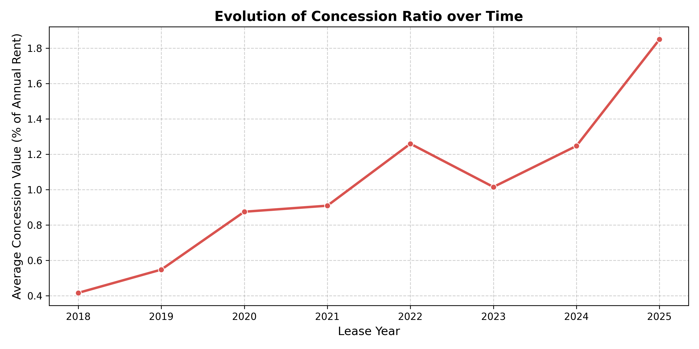
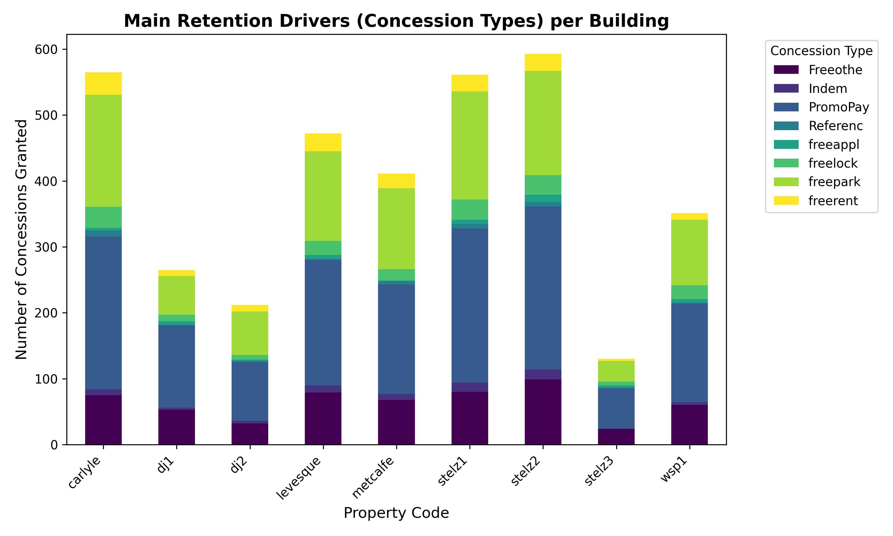
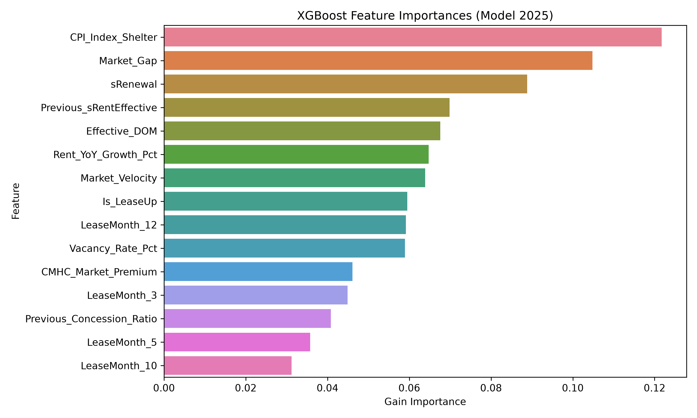
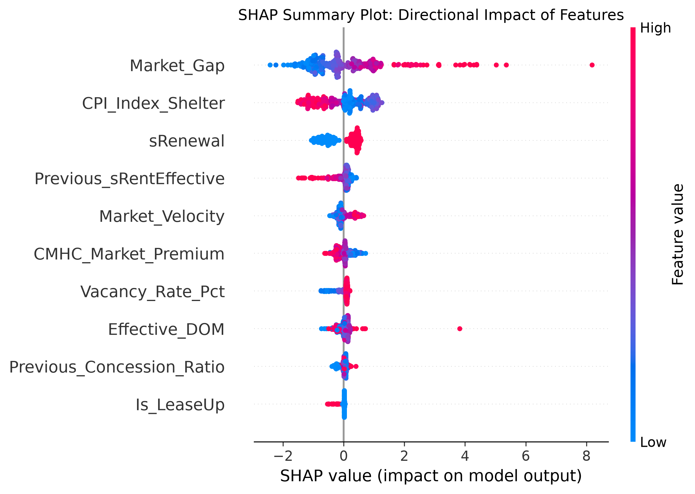
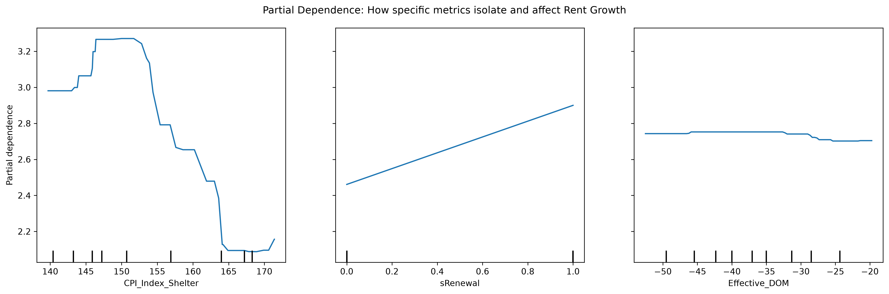

# Summary of Model Logic, Data, and Hypotheses

## Step-by-Step Calculation of Annualized Rent Growth

To guarantee an appropriate comparison, we calculated the rent growth strictly on a unit-by-unit basis before aggregating by building : 

1. We sorted the lease history chronologically by unit (`hUnit` and `sTermSeq`).
2. We shifted the data to isolate the `Previous_sRentEffective` and the `Previous_sLeaseFrom` date.
3. We calculated the exact time elapsed between the two leases (`gap_years`). We filtered out unstable short leases (under 0.1 years).
4. Finally, we calculated the **Compound Annual Growth Rate (CAGR)** as our target variable : `((Current_Effective / Previous_Effective) ^ (1 / gap_years) - 1) * 100`. 

### Target Variable Rationale 

We chose to use effective rent increase percentage as our target variable. Contractual rent is highly predictable but is not representative of the actual rent paid by tenants due to concessions, nor does it represent the actual cash flow for owners. 

Contractual rent is less of a challenge to predict since it is highly regulated and much less variable. 

We chose growth instead of median as the target variable to avoid composition effects. For example, the addition of new, higher-end buildings push the median up and distort the growth trajectory. 

## Decision to Evaluate Growth at the Building Level 

After training a Random Forest Regressor model at the unit level, we came to the conclusion that variability was much too affected by noise, and not very explainable by a model. FOr example, the negociation skills of tenants come into play a lot during lease renewals, and affect the rent increase in a way that is not capturable. 

We therefore decided to evaluate growth at the building level, while still comparing units against themselves, and taking an average increase per building. Themodel separates recommendations for renewals and turnovers, since both values evolve differently. 

### Calculation of Market Gap (Loss-to-Lease)

`Market_Gap` measures the pent-up revenue potential of a unit : 

1. We used a chronological `backward` merge (`pd.merge_asof`) to pair every lease signature with the exact `sAskingRent` advertised on the open market that same month.
2. We calculated `Market_Gap = sAskingRent - Previous_sRentEffective`. 
3. This isolates the exact dollar difference between what the tenant was historically paying, and what the landlord currently desires on the open market.

### Calculation of Market Velocity

`Market_Velocity` measures the momentum of the market leading up to the signature :

1. We used another `pd.merge_asof` to look back exactly 12 months from the current lease signature to find the trailing asking rent (`sAskingRent_12m_ago`).
2. We calculated the percentage change: `(Current Asking Rent - Trailing Asking Rent) / Trailing Asking Rent`.
3. This tells the model if the specific unit's market value is accelerating (high demand) or decelerating (softening market) right as the tenant is deciding to renew or leave.

## Data Preprocessing Pipeline

Before feeding raw data into the model or even calculating the target variables, we implemented a rigorous data cleaning pipeline to guarantee signal integrity:

1. **Date Standardization:** Columns like `sLeaseFrom` and `sLeaseTo` were immediately cast to pandas `datetime` objects. This was strictly necessary to enable chronological sorting, a hard requirement for the `backward` `pd.merge_asof` functions that prevent temporal data leakage.
2. **Missing Value Imputation:** Minor missing structural data (e.g., `sBaths` and `sSqft`) were filled with the dataset's median values. `sTermMonths` was defaulted to 12. This preserved valuable rows that were otherwise mathematically sound.
3. **Outlier Filtering:** After calculating our `growth_pct` target variable, we applied a strict bandpass filter: dropping any lease with a growth rate below **-25%** or above **+50%**. This critical step prevented the aggregated building averages from being poisoned by severe data-entry errors or edge cases (such as a tenant upgrading to a massive unit but keeping the same lease record).
4. **Noise Reduction at Aggregation:** Once the unit-level data was successfully grouped up to the `[sPropCode, Lease_Year, LeaseMonth, sRenewal]` level, we dropped any aggregated "bucket" that contained fewer than 3 total leases. This prevented the model from trying to learn patterns from highly volatile, low-volume months.

## Data Exploration

We decided to analyze at the building level, high volatility of new buildings, stronger concessions to attract new tenants, clear and clustered market cycles for older buildings.

Growth and rent price is affected by the CPI index

## Renewal vs Turnover 

Renewal growth rates become lower than turnover rates as of 2024. 

## Ideas Tried and Discarded 

Floor number : not enough signal

Square feet : linear rent increase, so no effect of growth 

## Distinction between Quebec and Ontario Regulations

Rent control legislation differs significantly between the two provinces, particularly concerning new constructions. To build a robust model capable of scaling across both portfolios, we engineered specific flags (`Is_Ontario` and `Is_LeaseUp`) to handle these regulatory nuances.

### Quebec: The Clause F Exemption
In Quebec, residential rent increases are heavily regulated by the Tribunal administratif du logement (TAL). However, under [Section 1955 of the Civil Code of Quebec (commonly referred to as Clause F)](https://www.tal.gouv.qc.ca/en/renewal-of-the-lease-and-fixing-of-rent/rent-increase), buildings erected within the last 5 years are exempt from these rent-fixing regulations. Landlords of these new properties can legally increase rent by any amount upon renewal. 

### Ontario: The Post-2018 Exemption
In Ontario, rent increases are governed by the Residential Tenancies Act. However, under the [2018 Rent Control Exemption](https://www.ontario.ca/page/residential-rent-increases#section-1), any new residential unit occupied for the first time after November 15, 2018, is completely exempt from rent control guidelines indefinitely.

### Model Integration (`Is_Ontario` & `Is_LeaseUp`)
Because our dataset contains properties across both provinces (e.g., The Met in Ontario, and the remaining properties in Quebec), we engineered the **`Is_Ontario`** binary flag. 
- By including `Is_Ontario` in the feature set, the model architecture explicitly differentiates between the two legislative regimes, allowing it to apply different baseline growth expectations based on geography.
- Furthermore, we built the **`Is_LeaseUp`** flag, which mathematically identifies buildings operating under rent-control exemptions (whether that is Quebec's 5-year rolling Clause F, or Ontario's permanent post-2018 exemption). This ensures the model learns to correctly predict aggressive, unregulated rent growth for new supply independently of the provincial flag.

## Model Exploration

We tried a Linear Regression model first and the results were not satisfactory, due to the non-linear relationship between the features and the target variable.

We then compared two Random Forest Regressors, one from sklearn and one from XGBoost. 

## Lease-Up Flag 

We wanted our model to distinguish between new constructions that are still in the lease-up phase and older buildings, which might be under stricter regulation and less volatile market conditions. To that end, we engineered a flag `Is_LeaseUp` that is 1 if the building is a new construction and 0 otherwise. 

## Accounting for Absorption 

To capture the market's absorption rate (how quickly vacant units are being leased), we engineered the **`Effective_DOM` (Days on Market)** feature. It is calculated as the difference between the start of the current lease and the end of the previous lease (`sLeaseFrom_dt - Previous_sLeaseTo_dt`). 

While this gives the model a proxy for demand (e.g., units sitting empty for 60+ days indicate low demand, forcing the model to predict lower rent growth), we acknowledge a distinct limitation: **inaccuracy due to lack of formal CRM data**. 
- Because we only have access to legally binding lease dates and lack a true "marketing start date", the model cannot distinguish between a unit that sat completely empty on the open market for 4 months versus a unit that was intentionally held back for 4 months due to major renovations or being used as a model suite. 
- Despite this noise, `Effective_DOM` proved to be highly impactful in our explainability framework, acting as a structural penalty curve to predicted rent growth for units that experience prolonged turnover gaps.

## Concessions 

### Evolution of Concession Ratio over Time

The chart below demonstrates how the total dollar value of concessions, expressed as a percentage of the annualized effective rent, has evolved over the portfolio's history. 

Historically, concession ratios hovered at lower, sustainable levels. However, new buildings were introduced in 2023, 2024, and 2025. New constructions typically require more concessions to attract tenants, leading to an increase in the overall concession ratio. 

### Main Retention Drivers per Building

Not all buildings incentivize tenants the same way. The stacked bar chart below maps the distinct concession structures used across the different property codes.

This highlights a clear market segmentation:
- **Brand New Buildings (Lease-Ups)** rely heavily on large, upfront "Months Free" concessions to rapidly fill vacant units without permanently lowering the legally-binding contractual rent.
- **Established Buildings** rely on smaller, targeted retention drivers like "Parking Promotions" or minor "Cash Rebates" to minimize churn among long-term, rent-controlled tenants.

## Explicability of Model

To ensure our model is not a "black box" and can be trusted by business stakeholders, we integrated advanced explainability frameworks (SHAP and Partial Dependence Plots) directly into the pipeline.

### Feature Importance Ranking
The XGBoost model uses Gain Importance to determine which variables are the most critical in splitting the decision trees. As seen below, `Market_Gap`, `Effective_DOM` (absorption), and `CMHC_Market_Premium` dominate the model's decision-making process.

### SHAP Values (Directional Impact)
While Feature Importance tells us *what* the model looks at, **SHAP (SHapley Additive exPlanations)** tells us *how* it reacts. SHAP maps the directional impact of our top 10 features on individual predictions.

**How to read this chart:**
- Red dots mean the feature value is high; blue dots mean it is low.
- A dot on the right side of the center line means the feature *increased* the predicted rent growth.
- **Example:** High `Market_Gap` (red dots) heavily pushes predictions to the right (higher rent growth). High `Effective_DOM` (red dots, meaning a unit sat vacant for a long time) pushes predictions to the left (suppressing rent growth).

### Partial Dependence Plots (PDP)
We used Partial Dependence Plots on the Random Forest regressor to isolate specific features and observe their non-linear thresholds.

These plots show exactly how the model reacts as a single variable scales:
- **`CPI_Index_Shelter`:** The model learns a clear step-function. Once inflation crosses a specific threshold, expected rent growth structurally shifts upward (mimicking TAL baseline adjustments).
- **`sRenewal`:** A stark binary drop. Renewals (1) inherently trigger lower expected growth compared to turnovers (0).
- **`Effective_DOM`:** A steep decay curve. Once a unit sits empty past 30-45 days, the model rapidly penalizes the expected rent growth, anticipating that the landlord will need to drop the price or offer a concession to secure a tenant.

## External Datasets Integration

To ensure the model responds to macroeconomic realities and not just isolated building metrics, we evaluated several external datasets:

### 1. `cmhc_consolidated.csv`
- **Source:** Canada Mortgage and Housing Corporation (CMHC).
- **Use in Model:** **Active.** We used this data to engineer two highly impactful macro features:
  - **`Vacancy_Rate_Pct`**: Mapped directly to the building's city and the specific unit's bedroom count (e.g., 2-bedroom units in Montreal). This directly informs the model of the supply/demand balance in the local market at the exact time of the lease signature.
  - **`CMHC_Market_Premium`**: This is a powerful, custom-engineered feature calculated as `(Previous_Rent - CMHC_Average_Rent) / CMHC_Average_Rent`. It gives the model a clear mathematical signal of how "luxurious" or "premium" a specific unit is compared to the city average. High-premium units often experience different growth constraints (affordability ceilings) compared to below-market units.

### 2. `cpi_inflation.csv`
- **Source:** Statistics Canada (Consumer Price Index).
- **Use in Model:** **Active.** We isolated the 'Shelter' component of the CPI to engineer the **`CPI_Index_Shelter`** feature. Because inflation data is legally published with a lag and the TAL relies on trailing metrics to set its rent increase guidelines, we merged this index using an 18-month trailing lag (`LeaseFrom_dt - 18 months`). This guarantees that the XGBoost model has the exact same economic context (inflationary pressure) that the landlord possessed when drafting the lease renewal.

### 3. `cpi_building_construction.csv`
- **Source:** Statistics Canada.
- **Use in Model:** **Discarded.** We evaluated this as a proxy for landlord operational cost increases (e.g., maintenance and CAPEX). However, it was discarded because rent control regulations (like the TAL) do not allow landlords to perfectly pass-through raw construction inflation on a 1-to-1 basis to thes tenant, making it a noisy signal for actual rent growth.

### 4. `conjoncture_loyer_qc.csv`
- **Source:** Statistics Canada (Localized Quebec CPI).
- **Use in Model:** **Discarded.** We explored this as a localized Quebec-specific CPI/rent index to capture granular provincial trends. However, we ultimately relied on the broader, standardized `cpi_inflation.csv` and the CMHC data to maintain a unified architecture that scales cleanly across both Ontario and Quebec portfolios.

## Model Results 

To rigorously test our models and completely avoid temporal data leakage (where a model learns from the future to predict the past), we implemented a **Walk-Forward Backtesting** architecture. The models were iteratively trained on historical years and tested strictly on unseen future years (2023, 2024, and 2025). 

We evaluated the algorithms based on **Mean Absolute Error (MAE)**, representing the average percentage point difference between the model's predicted rent growth and the actual realized rent growth.

### Out-of-Sample Performance

Both models successfully learned the underlying market dynamics, generating highly accurate out-of-sample predictions:

#### 1. Random Forest Regressor
The Random Forest model slightly outperformed XGBoost on this dataset, likely due to its robustness against the remaining noise in the unit-level aggregates.
- **Overall MAE:** `2.45%`
- **Renewal MAE:** `2.27%`
- **Turnover MAE:** `2.71%`

#### 2. XGBoost Regressor
The XGBoost model also performed exceptionally well, capturing the non-linear macroeconomic thresholds effectively.
- **Overall MAE:** `2.66%`
- **Renewal MAE:** `2.56%`
- **Turnover MAE:** `2.79%`

**Conclusion:** 
The models successfully predict aggregate building rent growth within a ~2.5% margin of error on unseen future data. Notably, both models predictably struggle slightly more with **Turnovers** (where landlords have greater pricing freedom and where unit-level renovations introduce unseen volatility) compared to **Renewals** (which are tightly bounded by TAL regulations and CPI baselines).
